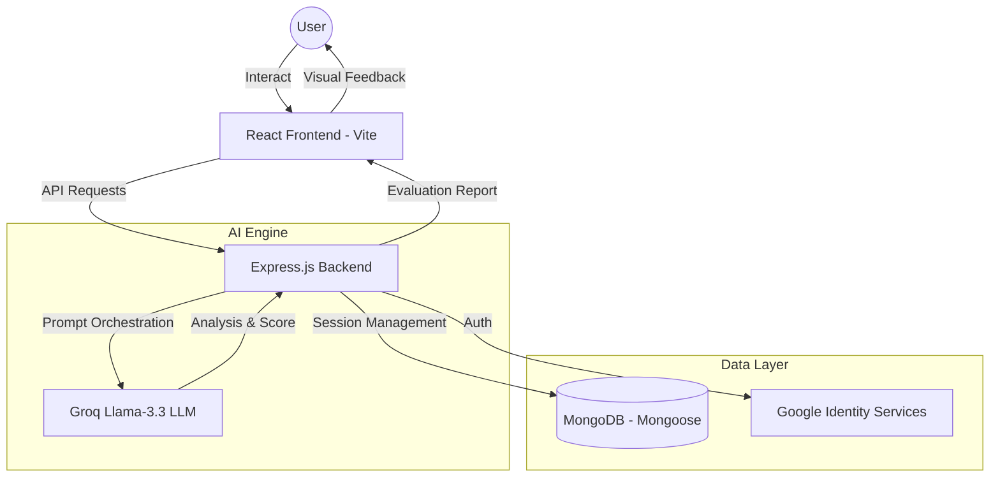

# InterviewIQ 🧠

**Revolutionizing Technical Preparations with Low-Latency AI Mock Interviews.**

[](https://interview-iq-nine-neon.vercel.app/)
[](https://interview-iq-backend.onrender.com/)
[](https://reactjs.org/)
[](https://nodejs.org/)
[](https://groq.com/)

---

## 🚀 Overview

InterviewIQ is an advanced AI-driven mock interview platform designed to bridge the gap between preparation and performance. By leveraging **Llama-3.3 (via Groq)** for ultra-fast processing and custom **Speech-to-Text** pipelines, InterviewIQ provides a realistic, high-pressure environment for candidates to sharpen their technical and behavioral skills.

### 🌟 Key Features

- **🤖 AI-Powered Adaptive Interviewer**: Real-time mock sessions that adapt to your role and expertise level.
- **🌍 Multilingual Intelligence**: Answer in your native language; our system intelligently translates and evaluates based on global English standards.
- **🎙️ Interactive TTS & STT**: Natural conversation flow with integrated Text-to-Speech (with speed controls) and highly accurate Speech-to-Text transcription.
- **📊 Granular Performance Analytics**: Professional score breakdowns including Technical Content, Communication, and Keyword Proficiency.
- **✨ Career Coach Analysis**: Post-interview personalized debriefs generated by AI to highlight core strengths and growth opportunities.
- **🔥 Momentum Tracking**: Daily goals and streak management to maintain consistent preparation habits.

---

## 🏗️ System Architecture

The following diagram illustrates the seamless data flow between the user, our high-performance backend, and the AI orchestration layer.



---

## 🛠️ Technical Stack

- **Frontend**: React 18, Tailwind CSS, Framer Motion (Animations), Lucide React (Icons), Zustand (State Management).
- **Backend**: Node.js, Express.js, Groq SDK.
- **Authentication**: JWT & Google OAuth 2.0.
- **Database**: MongoDB with Mongoose ODM.
- **Infrastructure**: Vercel (Frontend), Environment-aware API orchestration.

---

## ⚙️ Installation & Usage

### 1. Prerequisites
- Node.js (v18+)
- MongoDB connection string
- Groq API Key
- Google Client ID

### 2. Clone the Repository
```bash
git clone https://github.com/kshitij2212/InterviewIQ.git
cd InterviewIQ
```

### 3. Setup Backend
```bash
cd backend
npm install
# Create .env file with appropriate keys
npm run dev
```

### 4. Setup Frontend
```bash
cd ../frontend
npm install
# Update .env with VITE_API_URL and VITE_GOOGLE_CLIENT_ID
npm run dev
```

---

## 🌐 Deployment

| Component | Platform | Status | URL |
| :--- | :--- | :--- | :--- |
| **Frontend** |  |  | [interview-iq-nine-neon.vercel.app](https://interview-iq-nine-neon.vercel.app/) |
| **Backend** |  |  | [interviewiq-mar5.onrender.com](https://interviewiq-mar5.onrender.com/) |

### Environment Variables Required

#### Frontend (Vercel)
- `VITE_API_URL`: Your Render backend URL (e.g., `https://interviewiq-mar5.onrender.com/api/v1`)
- `VITE_GOOGLE_CLIENT_ID`: Your Google OAuth Client ID

#### Backend (Render/Hosting)
- `PORT`: 4000
- `MONGODB_URI`: Your MongoDB Atlas connection string
- `GROQ_API_KEY`: Your Groq Cloud API Key
- `JWT_SECRET`: A secure random string for token signing
- `GOOGLE_CLIENT_ID`: Your Google OAuth Client ID

---

## 💎 Why InterviewIQ?

> *"Preparation is the only difference between anxiety and confidence."*

Traditional prep platforms are static; **InterviewIQ is alive.** We've optimized every layer of the stack to provide an experience that doesn't just test your knowledge, but builds your muscle memory.

- **⚡ Neural-Speed Evaluation**: Powered by Groq's Llama-3.3, we provide sub-second feedback loops. No more waiting—get corrected the moment your sentence ends.
- **🧠 Cognitive Load Mimicry**: By combining TTS and STT, we simulate the sensory pressure of a real technical interview, helping you overcome "interview freeze."
- **📊 Multi-Dimensional Insight**: We don't just tell you if you're right; we analyze your communication clarity, technical depth, and specific keyword density.
- **🚀 Zero-Latency Thinking**: Our architecture is built for speed, ensuring that the AI interviewer responds with human-like fluidity, making the practice session truly immersive.

---
