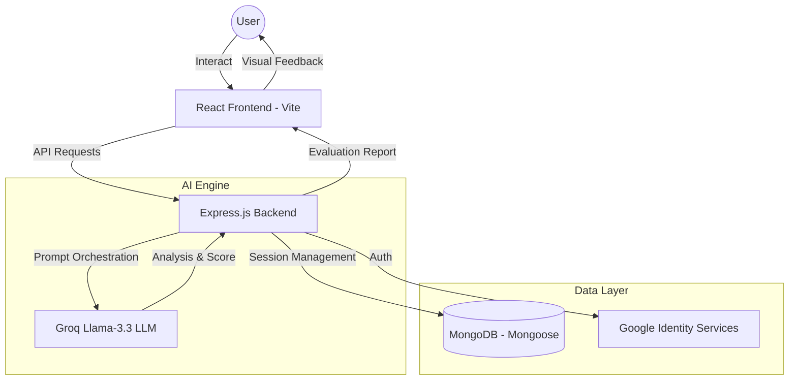

# InterviewIQ 🧠

**Revolutionizing Technical Preparations with Low-Latency AI Mock Interviews.**

<a href="https://interview-iq-nine-neon.vercel.app/" target="_blank"></a>
<a href="https://interviewiq-bf9m.onrender.com/" target="_blank"></a>
[](https://reactjs.org/)
[](https://nodejs.org/)
[](https://groq.com/)

---

## 🚀 Overview

**InterviewIQ** is an advanced AI-driven mock interview platform designed to bridge the gap between preparation and performance. By leveraging **Llama-3.3 (via Groq)** for ultra-fast processing and custom **Speech-to-Text** pipelines, InterviewIQ provides a realistic, high-pressure environment for candidates to sharpen their technical and behavioral skills.

---

## ✨ Key Features

| Feature | Description |
| :--- | :--- |
| **🤖 AI-Powered Adaptive Interviewer** | Real-time mock sessions that adapt to your role and expertise level. |
| **🌍 Multilingual Intelligence** | Answer in your native language; our system intelligently translates and evaluates based on global English standards. |
| **🎙️ Interactive TTS & STT** | Natural conversation flow with integrated Text-to-Speech (with speed controls) and highly accurate Speech-to-Text transcription. |
| **📊 Granular Performance Analytics** | Professional score breakdowns including Technical Content, Communication, and Keyword Proficiency. |
| **💡 Career Coach Analysis** | Post-interview personalized debriefs generated by AI to highlight core strengths and growth opportunities. |
| **🔥 Momentum Tracking** | Daily goals and streak management to maintain consistent preparation habits. |

---

## 🏗️ System Architecture

Our high-performance architecture ensures seamless data flow between the user, our backend, and the AI orchestration layer.


```mermaid
graph TD
    User((User)) -->|Interact| ReactFE[React Frontend - Vite]
    ReactFE -->|API Requests| ExpressBE[Express.js Backend]
    
    subgraph AI Engine
        ExpressBE -->|Prompt Orchestration| Llama3[Groq Llama-3.3 LLM]
        Llama3 -->|Analysis & Score| ExpressBE
    end
    
    subgraph Data Layer
        ExpressBE -->|Session Management| MongoDB[(MongoDB - Mongoose)]
        ExpressBE -->|Auth| GoogleAuth[Google Identity Services]
    end
    
    ExpressBE -->|Evaluation Report| ReactFE
    ReactFE -->|Visual Feedback| User
```

---

## 🛠️ Technical Stack

### **Frontend**
- **Framework:** React 18 (Vite)
- **Styling:** Tailwind CSS
- **Animations:** Framer Motion
- **Icons:** Lucide React
- **State Management:** Zustand

### **Backend & AI**
- **Environment:** Node.js, Express.js
- **AI Engine:** Groq SDK (Llama-3.3)
- **Authentication:** JWT & Google OAuth 2.0
- **Database:** MongoDB with Mongoose ODM

---

## ⚙️ Installation & Usage

### 1. Prerequisites
Ensure you have the following installed and set up:
- **[Node.js](https://nodejs.org/)** (v18+)
- **MongoDB** connection string
- **Groq API Key**
- **Google Client ID**

### 2. Clone the Repository
```bash
git clone https://github.com/kshitij2212/InterviewIQ.git
cd InterviewIQ
```

### 3. Setup Backend
Navigate to the backend directory and configure the environment:
```bash
cd backend
npm install
```
Create a `.env` file in the `backend` directory:
```env
PORT=4000
MONGODB_URI=your_mongodb_connection_string
GROQ_API_KEY=your_groq_api_key
JWT_SECRET=your_jwt_secret
GOOGLE_CLIENT_ID=your_google_client_id
```
Start the backend server:
```bash
npm run dev
```

### 4. Setup Frontend
Open a new terminal, navigate to the frontend directory:
```bash
cd frontend
npm install
```
Create a `.env` file in the `frontend` directory:
```env
VITE_API_URL=http://localhost:4000/api/v1
VITE_GOOGLE_CLIENT_ID=your_google_client_id
```
Start the frontend development server:
```bash
npm run dev
```

---

## 🌐 Deployment

| Component | Platform | Status | Live URL |
| :--- | :--- | :--- | :--- |
| **Frontend** |  |  | <a href="https://interview-iq-nine-neon.vercel.app/" target="_blank">InterviewIQ on Vercel</a> |
| **Backend** |  |  | <a href="https://interviewiq-bf9m.onrender.com/" target="_blank">InterviewIQ API</a> |

*(Ensure to update `VITE_API_URL` to your production backend URL when deploying the frontend.)*

---

## 📂 Folder Structure

```text
InterviewIQ/
├── backend/
│   ├── src/
│   │   ├── controllers/
│   │   ├── models/
│   │   ├── routes/
│   │   ├── services/
│   │   └── utils/
│   ├── .env.example
│   └── package.json
├── frontend/
│   ├── src/
│   │   ├── components/
│   │   ├── pages/
│   │   ├── store/
│   │   └── utils/
│   ├── .env.example
│   └── package.json
└── README.md
```

---

## 💎 Why InterviewIQ?

> *"Preparation is the only difference between anxiety and confidence."*

Traditional prep platforms are static; **InterviewIQ is alive.** We've optimized every layer of the stack to provide an experience that doesn't just test your knowledge, but builds your muscle memory.

- **⚡ Neural-Speed Evaluation**: Powered by Groq's Llama-3.3, we provide sub-second feedback loops. No more waiting—get corrected the moment your sentence ends.
- **🧠 Cognitive Load Mimicry**: By combining TTS and STT, we simulate the sensory pressure of a real technical interview, helping you overcome "interview freeze."
- **📊 Multi-Dimensional Insight**: We don't just tell you if you're right; we analyze your communication clarity, technical depth, and specific keyword density.
- **🚀 Zero-Latency Thinking**: Our architecture is built for speed, ensuring that the AI interviewer responds with human-like fluidity, making the practice session truly immersive.
